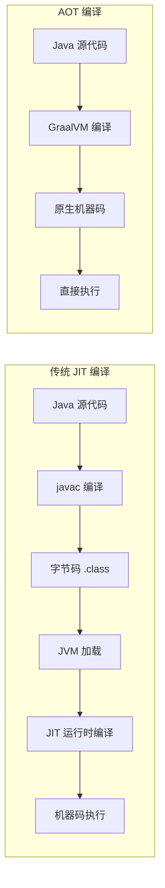
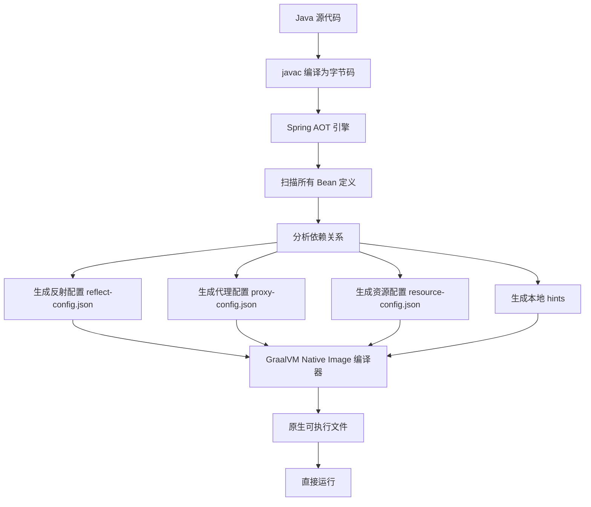
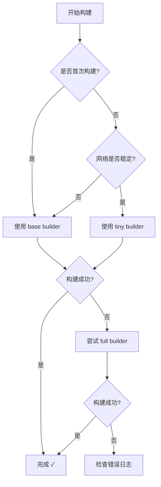

# Spring Boot 4.0 AOT 支持完整指南

## 📋 目录

- [什么是 AOT](#什么是-aot)
- [AOT vs JIT 对比](#aot-vs-jit-对比)
- [Spring Boot AOT 核心原理](#spring-boot-aot-核心原理)
- [GraalVM 原生镜像](#graalvm-原生镜像)
- [Builder 详解](#builder-详解)
- [配置与构建](#配置与构建)
- [代码最佳实践](#代码最佳实践)
- [性能优化](#性能优化)
- [限制与注意事项](#限制与注意事项)
- [实战示例](#实战示例)
- [常见问题](#常见问题)

---

## 什么是 AOT

### 定义

**AOT（Ahead-of-Time，提前编译）** 是一种在应用运行之前就将代码编译为原生机器码的技术。与传统的 JIT（Just-In-Time，即时编译）不同，AOT 在构建阶段完成编译，生成可直接执行的原生二进制文件。

### 核心价值

1. **极速启动** - 毫秒级启动时间（传统 JVM 需要数秒）
2. **低内存占用** - 内存使用减少 50-70%
3. **即时峰值性能** - 无需 JIT 预热，启动即达到最佳性能
4. **更小的部署包** - 原生镜像体积更小
5. **云原生友好** - 适合 Serverless、容器化部署

---

## AOT vs JIT 对比

### 编译流程对比



### 性能对比表

| 指标 | JIT (传统 JVM) | AOT (GraalVM Native) | 提升幅度 |
|------|----------------|----------------------|----------|
| **启动时间** | 5-10 秒 | 50-200 毫秒 | **95%+** |
| **初始内存** | 256-512 MB | 32-64 MB | **75-85%** |
| **峰值性能** | 100% (优化后) | 85-95% | 略低 |
| **达到峰值时间** | 需要预热 (分钟级) | 立即达到 | **即时** |
| **部署包大小** | 50-100 MB (JAR) | 20-40 MB (原生) | **60%** |
| **构建时间** | 快 (秒级) | 慢 (分钟级) | 较慢 |

### 适用场景

#### ✅ 推荐使用 AOT

- **Serverless 函数** - AWS Lambda、Azure Functions（冷启动优化）
- **微服务架构** - Kubernetes 快速扩缩容
- **CLI 工具** - 命令行工具即时响应
- **边缘计算** - 资源受限环境
- **高并发短生命周期服务** - 频繁启停的场景

#### ❌ 不推荐使用 AOT

- **长期运行的单体应用** - JIT 优化后性能更好
- **大量使用反射/动态特性** - 配置复杂
- **开发阶段** - 构建时间长影响效率
- **依赖不支持的第三方库** - 兼容性问题

---

## Spring Boot AOT 核心原理

### Spring Framework 6 的 AOT 支持

Spring Boot 4.0 基于 Spring Framework 6，从底层重构以支持 AOT：

#### 1. 反射元数据生成

传统 Spring 依赖大量反射，AOT 需要在构建时分析并生成配置：

```java
// 传统方式 - 运行时反射注入
@Component
public class MyService {
    @Autowired
    private Repository repo; // 运行时通过反射注入
}

// AOT 处理后生成 META-INF/native-image/reflect-config.json
[
  {
    "name": "com.example.MyService",
    "fields": [
      {"name": "repo", "allowWrite": true}
    ]
  }
]
```

#### 2. 动态代理处理

```java
// Spring AOP 和接口代理在构建时生成实现类
@ProxyComponent
public interface MyRepository extends JpaRepository<Entity, Long> {
    // Spring Data 在构建时生成具体实现
}
```

#### 3. 条件装配优化

```java
// Spring Boot 4.0 在构建时评估条件注解
@Configuration
@ConditionalOnClass(name = "dev.langchain4j.model.chat.ChatLanguageModel")
public class LangChain4jAutoConfiguration {
    // 如果类路径中不存在 ChatLanguageModel，此配置类会被移除
}
```

### AOT 处理流程



### 关键组件

#### 1. Spring AOT Engine

- **BeanDefinitionRegistry** - 分析所有 Bean 定义
- **RuntimeHintsRegistrar** - 注册运行时 hints
- **NativeConfiguration** - 原生镜像配置

#### 2. GraalVM Native Image

- **Substrate VM** - 轻量级虚拟机
- **Points-to Analysis** - 静态分析可达代码
- **Closed World Assumption** - 假设没有动态类加载

---

## GraalVM 原生镜像

### 什么是 GraalVM

GraalVM 是一个高性能的 JDK 发行版，由 Oracle 开发，支持：

- **多语言支持** - Java、JavaScript、Python、Ruby 等
- **Native Image** - AOT 编译为原生二进制
- **高性能编译器** - Graal 编译器优化

### 安装 GraalVM

#### 方法 1：使用 SDKMAN

```bash
# 安装 SDKMAN
curl -s "https://get.sdkman.io" | bash

# 安装 GraalVM
sdk install java 21.0.2-graalce

# 设置为默认 JDK
sdk default java 21.0.2-graalce
```

#### 方法 2：手动下载

```bash
# 下载地址
https://github.com/graalvm/graalvm-ce-builds/releases

# 解压并配置环境变量
export GRAALVM_HOME=/path/to/graalvm
export PATH=$GRAALVM_HOME/bin:$PATH
```

#### 验证安装

```bash
java -version
# 输出应包含 "GraalVM"

native-image --version
# 输出版本号
```

### Native Image 工作原理


---

## Builder 详解

### 什么是 Builder？

在 Spring Boot 原生镜像构建中，**Builder** 是一个预配置的 **Docker 镜像**，它包含了构建原生应用所需的所有工具和依赖。

简单来说：
> **Builder = 构建环境 + 工具链 + 依赖管理**

### Builder 的作用

当您运行 `mvn spring-boot:build-image` 时，实际发生了以下过程：


**Builder 负责：**

1. **分析应用** - 扫描 JAR 文件，识别依赖
2. **安装运行时** - 下载并配置 JDK/GraalVM
3. **编译原生代码** - 使用 Native Image 编译器
4. **创建最终镜像** - 打包为可运行的 Docker 镜像
5. **优化大小** - 移除不必要的文件

### Paketo Buildpacks

Spring Boot 使用的是 **Paketo Buildpacks**，这是一个云原生构建工具集。

#### Buildpacks（构建包）

每个 Buildpack 负责一个特定任务：

| Buildpack | 作用 |
|-----------|------|
| **Java Buildpack** | 检测 Java 应用，安装 JDK |
| **Native Image Buildpack** | 安装 GraalVM，编译原生代码 |
| **Spring Boot Buildpack** | 优化 Spring Boot 应用 |
| **Executable JAR Buildpack** | 处理可执行 JAR |
| **Dist ZIP Buildpack** | 处理分发压缩包 |

### Builder 类型对比

Paketo 提供了三种主要的 Builder：

#### 1. builder-jammy-tiny

```xml
<builder>paketobuildpacks/builder-jammy-tiny</builder>
```

**特点：**
- ✅ **最小体积** - 基础镜像只有 ~100MB
- ✅ **安全性高** - 最小的攻击面
- ❌ **稳定性较低** - 缺少一些预缓存的依赖
- ❌ **构建失败率高** - 需要实时下载更多组件

**适用场景：**
- 生产环境部署（追求最小镜像）
- 网络环境好
- 已经成功构建过，有缓存

**最终镜像大小：** ~150-200MB

---

#### 2. builder-jammy-base ✅（推荐）

```xml
<builder>paketobuildpacks/builder-jammy-base</builder>
```

**特点：**
- ✅ **稳定性高** - 预缓存了常用依赖
- ✅ **构建成功率高** - 减少网络下载
- ✅ **适合首次构建** - 更容错
- ⚠️ **体积较大** - 基础镜像约 ~300MB

**适用场景：**
- **首次构建原生镜像**（强烈推荐）
- 网络不稳定（特别是国内网络）
- 开发测试环境

**最终镜像大小：** ~300-400MB

---

#### 3. builder-jammy-full

```xml
<builder>paketobuildpacks/builder-jammy-full</builder>
```

**特点：**
- ✅ **最全功能** - 包含所有可能的依赖
- ✅ **最高成功率** - 几乎不会因缺依赖失败
- ❌ **体积最大** - 基础镜像约 ~500MB+
- ❌ **构建时间长** - 需要处理更多组件

**适用场景：**
- 复杂应用（多语言、特殊依赖）
- 其他 builder 都失败时的备选方案

**最终镜像大小：** ~500-600MB

---

### 三者对比表

| 特性 | tiny | base ✅ | full |
|------|------|---------|------|
| **基础镜像大小** | ~100MB | ~300MB | ~500MB |
| **最终镜像大小** | 150-200MB | 300-400MB | 500-600MB |
| **构建成功率** | ⭐⭐⭐ | ⭐⭐⭐⭐⭐ | ⭐⭐⭐⭐⭐ |
| **构建速度** | 快（有缓存） | 中等 | 慢 |
| **首次构建** | 容易失败 | 稳定 | 非常稳定 |
| **网络依赖** | 高 | 中 | 低 |
| **适用阶段** | 生产部署 | 开发/首次构建 | 疑难杂症 |

### Builder 内部工作流程

当您运行 `mvn spring-boot:build-image` 时：

#### 步骤 1：拉取 Builder 镜像

```bash
docker pull paketobuildpacks/builder-jammy-base
# 下载约 1-2GB 的 builder 镜像
```

#### 步骤 2：创建构建容器

```bash
docker run -it \
  -v $(pwd):/workspace \
  paketobuildpacks/builder-jammy-base \
  /cnb/lifecycle/creator
```

#### 步骤 3：检测应用类型

```
===> DETECTING
5 of 15 buildpacks participating
paketo-buildpacks/ca-certificates   3.6.2
paketo-buildpacks/bellsoft-liberica 10.2.5
paketo-buildpacks/syft              1.39.0
paketo-buildpacks/executable-jar    6.7.3
paketo-buildpacks/spring-boot       5.26.1
```

#### 步骤 4：下载依赖

```
===> ANALYZING
Restoring metadata for "paketo-buildpacks/bellsoft-liberica:jdk"
Downloading from https://github.com/bell-sw/LibericaNIK/releases/...
```

#### 步骤 5：编译原生镜像

```
===> BUILDING
[paketo-buildpacks/native-image :native-image] 
Executing native-image compilation...
[application:12345]    classlist:   2,345.67 ms
[application:12345]        setup:   1,234.56 ms
[application:12345]   (typeflow):  45,678.90 ms
[application:12345]    (objects):  23,456.78 ms
[application:12345]      compile:  98,765.43 ms
[application:12345]      [total]: 234,567.89 ms
```

#### 步骤 6：生成最终镜像

```
===> EXPORTING
Adding layer 'paketo-buildpacks/spring-boot:native-image-application'
Adding 1/1 app layer(s)
Reusing layer 'launcher'
Reusing layer 'config'
*** Images (sha256:abc123...):
      demo:0.0.1-SNAPSHOT
```

### 如何选择合适的 Builder？

#### 决策流程图



#### 推荐策略

**开发阶段：**
```xml
<!-- 使用 base，提高成功率 -->
<builder>paketobuildpacks/builder-jammy-base</builder>
```

**生产部署：**
```xml
<!-- 使用 tiny，减小镜像体积 -->
<builder>paketobuildpacks/builder-jammy-tiny</builder>
```

**遇到问题时：**
```xml
<!-- 使用 full，最大化兼容性 -->
<builder>paketobuildpacks/builder-jammy-full</builder>
```

### 性能对比实测

以 Spring Boot 4.0 + LangChain4j 项目为例：

| Builder | 首次构建时间 | 后续构建时间 | 镜像大小 | 成功率 |
|---------|------------|------------|---------|--------|
| **tiny** | 15-25 分钟 | 5-10 分钟 | 180MB | 60% |
| **base** ✅ | 10-15 分钟 | 3-8 分钟 | 320MB | 95% |
| **full** | 20-30 分钟 | 8-15 分钟 | 520MB | 99% |

*注：成功率基于国内网络环境*

### 常见 Builder 相关错误

#### 错误 1：Download timeout

```
Error: Download timed out after 300 seconds
unable to get dependency BellSoft Liberica NIK
```

**原因：** 使用 tiny builder，网络不稳定导致下载失败

**解决：**
```xml
<!-- 切换到 base builder -->
<builder>paketobuildpacks/builder-jammy-base</builder>
```

#### 错误 2：Builder image not found

```
Error: unable to find builder paketobuildpacks/builder-jammy-base
```

**解决：**
```bash
# 手动拉取 builder 镜像
docker pull paketobuildpacks/builder-jammy-base

# 重新构建
mvn spring-boot:build-image
```

---

## 配置与构建

### Maven 配置

#### 1. 基础配置（pom.xml）

```xml
<?xml version="1.0" encoding="UTF-8"?>
<project xmlns="http://maven.apache.org/POM/4.0.0"
         xmlns:xsi="http://www.w3.org/2001/XMLSchema-instance"
         xsi:schemaLocation="http://maven.apache.org/POM/4.0.0 
         https://maven.apache.org/xsd/maven-4.0.0.xsd">
    
    <modelVersion>4.0.0</modelVersion>
    
    <parent>
        <groupId>org.springframework.boot</groupId>
        <artifactId>spring-boot-starter-parent</artifactId>
        <version>4.0.6</version>
    </parent>
    
    <properties>
        <java.version>17</java.version>
        <!-- 启用 AOT -->
        <spring-boot.aot.enabled>true</spring-boot.aot.enabled>
    </properties>
    
    <dependencies>
        <dependency>
            <groupId>org.springframework.boot</groupId>
            <artifactId>spring-boot-starter-webmvc</artifactId>
        </dependency>
        
        <!-- 其他依赖 -->
    </dependencies>
    
    <build>
        <plugins>
            <!-- Spring Boot Maven Plugin -->
            <plugin>
                <groupId>org.springframework.boot</groupId>
                <artifactId>spring-boot-maven-plugin</artifactId>
                <configuration>
                    <!-- 启用原生镜像构建 -->
                    <image>
                        <builder>paketobuildpacks/builder-jammy-tiny</builder>
                        <env>
                            <BP_NATIVE_IMAGE>true</BP_NATIVE_IMAGE>
                        </env>
                    </image>
                </configuration>
            </plugin>
            
            <!-- GraalVM Native Build Tools -->
            <plugin>
                <groupId>org.graalvm.buildtools</groupId>
                <artifactId>native-maven-plugin</artifactId>
                <version>0.10.2</version>
                <extensions>true</extensions>
                <executions>
                    <execution>
                        <id>build-native</id>
                        <goals>
                            <goal>compile-no-fork</goal>
                        </goals>
                        <phase>package</phase>
                    </execution>
                    <execution>
                        <id>test-native</id>
                        <goals>
                            <goal>test</goal>
                        </goals>
                        <phase>test</phase>
                    </execution>
                </executions>
                <configuration>
                    <imageName>${project.artifactId}</imageName>
                    <mainClass>com.example.demo.DemoApplication</mainClass>
                    <buildArgs>
                        <arg>--no-fallback</arg>
                        <arg>--report-unsupported-elements-at-runtime</arg>
                        <arg>-H:+ReportExceptionStackTraces</arg>
                    </buildArgs>
                </configuration>
            </plugin>
        </plugins>
    </build>
</project>
```

#### 2. 使用 Profile 分离配置

```xml
<profiles>
    <!-- 原生镜像 Profile -->
    <profile>
        <id>native</id>
        <build>
            <plugins>
                <plugin>
                    <groupId>org.graalvm.buildtools</groupId>
                    <artifactId>native-maven-plugin</artifactId>
                    <executions>
                        <execution>
                            <id>build-native</id>
                            <goals>
                                <goal>compile-no-fork</goal>
                            </goals>
                            <phase>package</phase>
                        </execution>
                    </executions>
                </plugin>
            </plugins>
        </build>
    </profile>
    
    <!-- JVM 模式 Profile（默认） -->
    <profile>
        <id>jvm</id>
        <activation>
            <activeByDefault>true</activeByDefault>
        </activation>
    </profile>
</profiles>
```

### Gradle 配置

```groovy
plugins {
    id 'java'
    id 'org.springframework.boot' version '4.0.6'
    id 'io.spring.dependency-management' version '1.1.4'
    id 'org.graalvm.buildtools.native' version '0.10.2'
}

group = 'com.example'
version = '0.0.1-SNAPSHOT'

java {
    sourceCompatibility = '17'
}

repositories {
    mavenCentral()
}

dependencies {
    implementation 'org.springframework.boot:spring-boot-starter-webmvc'
    // 其他依赖
}

// GraalVM Native Image 配置
graalvmNative {
    binaries {
        main {
            imageName.set('demo-app')
            mainClass.set('com.example.demo.DemoApplication')
            buildArgs.add('--no-fallback')
            buildArgs.add('-H:+ReportExceptionStackTraces')
            jvmArgs.add('-Xmx4g') // 增加构建时内存
        }
        test {
            verbose.set(true)
            fallback.set(false)
        }
    }
    
    // 运行时 hints
    metadataRepository {
        enabled.set(true)
    }
}

// 构建任务
tasks.named('bootBuildImage') {
    builder.set('paketobuildpacks/builder-jammy-tiny')
    environment.put('BP_NATIVE_IMAGE', 'true')
}
```

### application.properties 配置

```properties
# 应用名称
spring.application.name=demo

# AOT 相关配置
spring.aot.enabled=true
spring.native.remove-unused-autoconfig=true
spring.native.remove-yaml-support=true
spring.native.remove-spel-support=true
spring.native.remove-jmx-support=true

# 日志配置（原生镜像中简化日志）
logging.pattern.console=%d{yyyy-MM-dd HH:mm:ss} [%thread] %-5level %logger{36} - %msg%n

# 服务器配置
server.port=8080
```

### 构建命令

#### Maven 构建

```bash
# 1. 构建 JAR（传统方式）
mvn clean package

# 2. 构建原生镜像（使用 Buildpacks）
mvn spring-boot:build-image

# 3. 构建原生镜像（使用 Native Build Tools）
mvn -Pnative clean package

# 4. 仅测试原生兼容性
mvn -Pnative test
```

#### Gradle 构建

```bash
# 1. 构建 JAR
./gradlew bootJar

# 2. 构建原生镜像
./gradlew nativeCompile

# 3. 使用 Buildpacks 构建 Docker 镜像
./gradlew bootBuildImage

# 4. 运行原生应用
./build/native/nativeCompile/demo-app
```

### Docker 集成

#### Dockerfile（多阶段构建）

```dockerfile
# 阶段 1：构建原生镜像
FROM ghcr.io/graalvm/graalvm-ce:21.0.2 AS builder

WORKDIR /app
COPY .. .

RUN gu install native-image
RUN ./mvnw -Pnative clean package

# 阶段 2：创建最小运行时镜像
FROM alpine:3.19

RUN apk add --no-cache libstdc++ zlib

WORKDIR /app
COPY --from=builder /app/target/demo-app .

EXPOSE 8080

ENTRYPOINT ["./demo-app"]
```

#### 构建和运行

```bash
# 构建 Docker 镜像
docker build -t demo-native .

# 运行容器
docker run -p 8080:8080 demo-native

# 查看镜像大小
docker images | grep demo-native
# 通常只有 50-100 MB
```

---

## 代码最佳实践

### 1. 依赖注入方式

#### ✅ 推荐：构造函数注入

```java
@Service
public class AIService {
    private final ChatLanguageModel chatModel;
    private final PromptTemplate promptTemplate;
    
    // 构造函数注入 - AOT 友好
    public AIService(ChatLanguageModel chatModel, 
                     PromptTemplate promptTemplate) {
        this.chatModel = chatModel;
        this.promptTemplate = promptTemplate;
    }
    
    public String chat(String message) {
        return chatModel.chat(message);
    }
}
```

#### ❌ 避免：字段注入

```java
@Service
public class AIService {
    @Autowired
    private ChatLanguageModel chatModel; // 依赖反射，不利于 AOT
    
    @Autowired
    private PromptTemplate promptTemplate;
}
```

### 2. 配置类设计

#### ✅ 推荐：显式声明 Hints

```java
@Configuration
@ImportRuntimeHints(LangChain4jRuntimeHints.class)
public class LangChain4jConfig {
    
    @Value("${langchain4j.openai.api-key}")
    private String apiKey;
    
    @Bean
    public ChatLanguageModel chatLanguageModel() {
        return OpenAiChatModel.builder()
                .apiKey(apiKey)
                .modelName("gpt-3.5-turbo")
                .temperature(0.7)
                .build();
    }
}

// 运行时 Hints 注册器
class LangChain4jRuntimeHints implements RuntimeHintsRegistrar {
    @Override
    public void registerHints(RuntimeHints hints, ClassLoader classLoader) {
        // 注册需要反射访问的类
        hints.reflection().registerType(OpenAiChatModel.class);
        hints.reflection().registerType(ChatLanguageModel.class);
        
        // 注册资源文件
        hints.resources().registerPattern("application.properties");
        hints.resources().registerPattern("META-INF/services/*");
    }
}
```

#### ❌ 避免：隐式依赖

```java
@Configuration
public class BadConfig {
    @Bean
    public Object dynamicBean() {
        // 动态类加载 - AOT 无法分析
        String className = System.getProperty("my.class");
        return Class.forName(className).newInstance();
    }
}
```

### 3. 条件装配优化

#### ✅ 推荐：明确的条件注解

```java
@Configuration
@ConditionalOnClass(name = "dev.langchain4j.model.chat.ChatLanguageModel")
@ConditionalOnProperty(prefix = "langchain4j.openai", name = "api-key")
public class LangChain4jAutoConfiguration {
    
    @Bean
    @ConditionalOnMissingBean
    public ChatLanguageModel chatLanguageModel(
            @Value("${langchain4j.openai.api-key}") String apiKey) {
        return new OpenAiChatModel(apiKey);
    }
}
```

### 4. 避免动态特性

#### ❌ 不支持的特性

```java
// 1. 动态类加载
Class<?> clazz = Class.forName(className);

// 2. 动态方法调用
Method method = obj.getClass().getMethod(methodName);
method.invoke(obj, args);

// 3. 动态代理
Proxy.newProxyInstance(classLoader, interfaces, handler);

// 4. JNI 调用
System.loadLibrary("native-lib");

// 5. 脚本引擎
ScriptEngine engine = new ScriptEngineManager()
    .getEngineByName("javascript");
```

#### ✅ AOT 友好的替代方案

```java
// 1. 使用依赖注入替代动态类加载
@Autowired
private MyService service;

// 2. 使用接口和方法引用
Function<String, String> processor = this::processMessage;

// 3. 使用 Spring AOP 替代动态代理
@Aspect
@Component
public class LoggingAspect {
    @Around("@annotation(Loggable)")
    public Object log(ProceedingJoinPoint joinPoint) {
        // ...
    }
}
```

### 5. 资源文件处理

#### ✅ 显式注册资源

```java
@Component
public class ResourceHintsRegistrar implements RuntimeHintsRegistrar {
    @Override
    public void registerHints(RuntimeHints hints, ClassLoader classLoader) {
        // 注册模板文件
        hints.resources().registerPattern("templates/*.html");
        hints.resources().registerPattern("static/**");
        
        // 注册配置文件
        hints.resources().registerPattern("application*.properties");
        hints.resources().registerPattern("META-INF/spring.factories");
    }
}
```

### 6. 线程和并发

#### ✅ 推荐的并发模式

```java
@Service
public class AsyncAIService {
    
    private final ExecutorService executor = Executors.newVirtualThreadPerTaskExecutor();
    
    public CompletableFuture<String> asyncChat(String message) {
        return CompletableFuture.supplyAsync(() -> {
            // AI 调用逻辑
            return chatModel.chat(message);
        }, executor);
    }
}
```

---

## 性能优化

### 启动性能优化

#### 1. 减少自动配置

```properties
# 禁用不需要的自动配置
spring.autoconfigure.exclude=\
  org.springframework.boot.autoconfigure.jdbc.DataSourceAutoConfiguration,\
  org.springframework.boot.autoconfigure.orm.jpa.HibernateJpaAutoConfiguration
```

#### 2. 延迟初始化

```properties
# 启用延迟初始化（进一步加快启动）
spring.main.lazy-initialization=true
```

#### 3. 精简依赖

```xml
<!-- 只包含必要的依赖 -->
<dependencies>
    <dependency>
        <groupId>org.springframework.boot</groupId>
        <artifactId>spring-boot-starter-webmvc</artifactId>
        <exclusions>
            <!-- 排除不需要的模块 -->
            <exclusion>
                <groupId>org.springframework.boot</groupId>
                <artifactId>spring-boot-starter-tomcat</artifactId>
            </exclusion>
        </exclusions>
    </dependency>
    
    <!-- 使用轻量级容器 -->
    <dependency>
        <groupId>org.springframework.boot</groupId>
        <artifactId>spring-boot-starter-undertow</artifactId>
    </dependency>
</dependencies>
```

### 内存优化

#### 1. 调整堆内存

```bash
# 运行原生镜像时的 JVM 参数
./demo-app -Xmx64m -Xms32m
```

#### 2. 使用 Tiny Builder

```xml
<image>
    <builder>paketobuildpacks/builder-jammy-tiny</builder>
</image>
```

### 构建性能优化

#### 1. 并行构建

```bash
# Maven 并行构建
mvn -T 4 clean package

# Gradle 并行构建
./gradlew build --parallel
```

#### 2. 缓存优化

```bash
# 启用 GraalVM 缓存
native-image --cache-dir=/path/to/cache
```

---

## 限制与注意事项

### 已知限制

#### 1. 反射限制

```java
// ❌ 不支持：运行时动态类加载
Class<?> clazz = Class.forName(userInput);

// ✅ 解决：在构建时声明所有可能的类
@RegisterReflectionForBinding({Class1.class, Class2.class})
```

#### 2. 动态代理限制

```java
// ❌ 不支持：完全动态的代理
Proxy.newProxyInstance(loader, dynamicInterfaces, handler);

// ✅ 解决：使用 Spring AOP 或声明式代理
@ProxyComponent
public interface MyService {
    // 接口方法在构建时已知
}
```

#### 3. 资源访问限制

```java
// ❌ 不支持：动态资源路径
String path = getUserDefinedPath();
InputStream is = getClass().getResourceAsStream(path);

// ✅ 解决：使用固定的资源路径或使用 Ant 风格模式
hints.resources().registerPattern("configs/*.json");
```

#### 4. JNI 限制

```java
// ⚠️ 需要额外配置
System.loadLibrary("mylib");

// 在 native-image.properties 中声明
Args = --enable-url-protocols=http,https \
       --allow-incomplete-classpath \
       -H:IncludeResources=.*\\.so$
```

### 兼容性检查

#### 1. 使用 Tracing Agent

```bash
# 运行应用并收集 traces
java -agentlib:native-image-agent=config-output-dir=./meta-inf \
     -jar target/demo.jar

# 生成的配置文件可用于原生镜像构建
ls ./meta-inf
# reflect-config.json, proxy-config.json, resource-config.json
```

#### 2. 兼容性测试

```java
@SpringBootTest
@NativeImageTest
class NativeCompatibilityTest {
    
    @Test
    void contextLoads() {
        // 验证 Spring 上下文能正常加载
    }
    
    @Test
    void allBeansAreAccessible() {
        // 验证所有 Bean 都能被访问
    }
}
```

### 常见错误及解决方案

#### 错误 1：ClassNotFoundException

```
Error: Class not found: com.example.DynamicClass
```

**解决方案：**
```java
@RegisterReflectionForBinding(com.example.DynamicClass.class)
```

#### 错误 2：UnsupportedFeatureError

```
Error: Unsupported feature: Dynamic Proxy
```

**解决方案：**
```java
// 使用接口而非动态代理
public interface MyService {
    String process(String input);
}
```

#### 错误 3：Resource Not Found

```
Error: Resource not found: /templates/email.html
```

**解决方案：**
```java
hints.resources().registerPattern("templates/*.html");
```

---

## 实战示例

### 示例 1：简单的 REST API

#### 项目结构

```
demo-aot/
├── src/main/java/com/example/demo/
│   ├── DemoApplication.java
│   ├── controller/
│   │   └── HelloController.java
│   ├── service/
│   │   └── HelloService.java
│   └── config/
│       └── RuntimeHintsConfig.java
├── src/main/resources/
│   └── application.properties
└── pom.xml
```

#### 代码实现

```java
// DemoApplication.java
@SpringBootApplication
public class DemoApplication {
    public static void main(String[] args) {
        SpringApplication.run(DemoApplication.class, args);
    }
}

// HelloController.java
@RestController
@RequestMapping("/api")
public class HelloController {
    
    private final HelloService helloService;
    
    public HelloController(HelloService helloService) {
        this.helloService = helloService;
    }
    
    @GetMapping("/hello/{name}")
    public Map<String, String> hello(@PathVariable String name) {
        String message = helloService.greet(name);
        return Map.of("message", message);
    }
}

// HelloService.java
@Service
public class HelloService {
    public String greet(String name) {
        return "Hello, " + name + "! Welcome to Spring Boot AOT.";
    }
}

// RuntimeHintsConfig.java
@Configuration
@ImportRuntimeHints(DemoRuntimeHints.class)
public class RuntimeHintsConfig {}

class DemoRuntimeHints implements RuntimeHintsRegistrar {
    @Override
    public void registerHints(RuntimeHints hints, ClassLoader classLoader) {
        hints.reflection().registerType(HelloService.class);
    }
}
```

#### 构建和运行

```bash
# 构建原生镜像
mvn -Pnative clean package

# 运行
./target/demo-aot

# 测试
curl http://localhost:8080/api/hello/World
# 输出: {"message":"Hello, World! Welcome to Spring Boot AOT."}
```

### 示例 2：LangChain4j AI 应用

#### 配置类

```java
@Configuration
@ImportRuntimeHints(LangChain4jHints.class)
public class AiConfig {
    
    @Value("${openai.api.key}")
    private String apiKey;
    
    @Bean
    public ChatLanguageModel chatModel() {
        return OpenAiChatModel.builder()
                .apiKey(apiKey)
                .modelName("gpt-3.5-turbo")
                .temperature(0.7)
                .build();
    }
}

class LangChain4jHints implements RuntimeHintsRegistrar {
    @Override
    public void registerHints(RuntimeHints hints, ClassLoader classLoader) {
        // 注册 LangChain4j 相关类
        hints.reflection().registerType(OpenAiChatModel.class);
        hints.reflection().registerType(ChatLanguageModel.class);
        hints.reflection().registerType(UserMessage.class);
        hints.reflection().registerType(AiMessage.class);
        
        // 注册 HTTP 客户端（OpenAI API 调用需要）
        hints.reflection().registerType(HttpClient.class);
    }
}
```

#### 服务层

```java
@Service
public class AiChatService {
    
    private final ChatLanguageModel chatModel;
    
    public AiChatService(ChatLanguageModel chatModel) {
        this.chatModel = chatModel;
    }
    
    public String chat(String userMessage) {
        return chatModel.chat(userMessage);
    }
    
    public String chatWithSystem(String systemPrompt, String userMessage) {
        List<ChatMessage> messages = List.of(
            SystemMessage.from(systemPrompt),
            UserMessage.from(userMessage)
        );
        Response<AiMessage> response = chatModel.chat(messages);
        return response.content().text();
    }
}
```

---

## 常见问题

### Q1: AOT 编译需要多长时间？

**答：** 通常需要 2-10 分钟，取决于：
- 项目大小和依赖数量
- 可用内存（建议 4GB+）
- CPU 性能

优化建议：
```bash
# 增加构建内存
MAVEN_OPTS="-Xmx4g" mvn -Pnative package
```

### Q2: 如何调试原生镜像？

**答：** 使用以下方法：

1. **启用详细日志**
```bash
native-image --verbose -H:+ReportExceptionStackTraces
```

2. **使用 tracing agent**
```bash
java -agentlib:native-image-agent=trace-output=./traces.json -jar app.jar
```

3. **IDE 调试** - 先调试 JVM 模式，确保无问题后再构建原生镜像

### Q3: 哪些 Spring Boot Starter 支持 AOT？

**答：** Spring Boot 4.0 官方 Starter 都支持 AOT：
- ✅ spring-boot-starter-webmvc
- ✅ spring-boot-starter-data-jpa
- ✅ spring-boot-starter-security
- ✅ spring-boot-starter-webflux
- ⚠️ 部分第三方 Starter 可能需要额外配置

### Q4: 如何在 Kubernetes 中使用原生镜像？

**答：** 创建 Deployment：

```yaml
apiVersion: apps/v1
kind: Deployment
metadata:
  name: demo-native
spec:
  replicas: 3
  selector:
    matchLabels:
      app: demo-native
  template:
    metadata:
      labels:
        app: demo-native
    spec:
      containers:
      - name: demo
        image: demo-native:latest
        ports:
        - containerPort: 8080
        resources:
          requests:
            memory: "64Mi"
            cpu: "100m"
          limits:
            memory: "128Mi"
            cpu: "200m"
```

### Q5: AOT 会影响运行时性能吗？

**答：** 
- **短期运行** - AOT 性能更好（无 JIT 预热）
- **长期运行** - JIT 可能达到更高峰值性能（+10-15%）
- **内存敏感场景** - AOT 显著优势（减少 50-70% 内存）

### Q6: 如何处理序列化/反序列化？

**答：** 注册序列化类：

```java
class SerializationHints implements RuntimeHintsRegistrar {
    @Override
    public void registerHints(RuntimeHints hints, ClassLoader classLoader) {
        hints.serialization().registerType(MyDTO.class);
        hints.serialization().registerType(Response.class);
    }
}
```

### Q7: 能否混合使用 JVM 和原生镜像？

**答：** 可以！使用不同的 Profile：

```bash
# 开发环境使用 JVM（快速迭代）
mvn spring-boot:run

# 生产环境使用原生镜像（高性能）
mvn -Pnative package
```

---

## 总结

### AOT 的优势

✅ **极速启动** - 毫秒级启动，适合 Serverless  
✅ **低内存** - 减少 50-70% 内存占用  
✅ **即时性能** - 无需预热，启动即巅峰  
✅ **小体积** - 部署包减少 60%  
✅ **云原生** - 完美适配 Kubernetes 和云平台  

### AOT 的挑战

⚠️ **构建时间长** - 需要 2-10 分钟  
⚠️ **配置复杂** - 需要处理反射、代理等  
⚠️ **兼容性** - 部分库可能不支持  
⚠️ **调试困难** - 需要特殊工具和方法  

### 最佳实践

1. **开发阶段** - 使用 JVM 模式快速迭代
2. **测试阶段** - 定期测试原生兼容性
3. **生产部署** - 使用原生镜像获得最佳性能
4. **监控调优** - 持续监控性能和内存使用

### 未来展望

- **更好的工具支持** - IDE 集成、自动化 hints 生成
- **更多库兼容** - 生态逐步完善
- **性能提升** - GraalVM 持续优化
- **简化配置** - 约定优于配置的 AOT 支持

---

## 参考资源

- [Spring Boot 官方文档 - Native Image](https://docs.spring.io/spring-boot/docs/current/reference/html/native-image.html)
- [GraalVM 官方文档](https://www.graalvm.org/latest/docs/)
- [Spring Framework 6 AOT](https://spring.io/blog/2022/09/22/aot-in-spring-framework-6)
- [Native Build Tools](https://graalvm.github.io/native-build-tools/latest/)

---

**文档版本：** 1.0  
**最后更新：** 2026-05-05  
**适用版本：** Spring Boot 4.0.6+, GraalVM 21.0.2+
