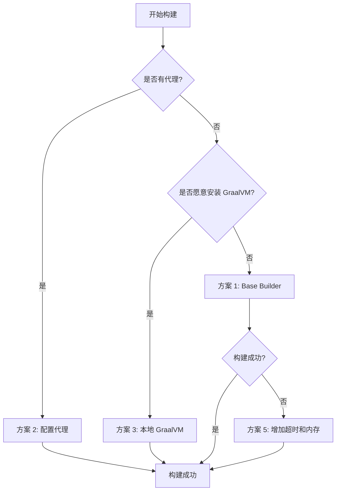

# Spring Boot 原生镜像构建故障排除指南

## 问题描述

构建原生镜像时出现以下错误：

```
unable to get dependency BellSoft Liberica NIK. see DEBUG log level
ERROR: failed to build: exit status 1
```

这是因为从 GitHub 下载 BellSoft Liberica Native Image Kit (NIK) 失败，通常由以下原因导致：
- 网络连接不稳定
- GitHub 访问受限（特别是国内网络）
- 下载超时

---

## 解决方案

### ✅ 方案 1：使用 Base Builder（已应用）

**优点**：更稳定，包含更多预缓存的依赖  
**缺点**：镜像体积稍大（约 300MB vs 150MB）

已在 `pom.xml` 中修改：
```xml
<builder>paketobuildpacks/builder-jammy-base</builder>
```

**重新构建**：
```bash
mvn spring-boot:build-image
```

---

### ✅ 方案 2：配置 Docker 代理（推荐国内用户）

如果您有代理工具，可以配置 Docker 使用代理：

#### Windows PowerShell

```powershell
# 设置环境变量（替换为您的代理地址）
$env:HTTP_PROXY="http://127.0.0.1:7890"
$env:HTTPS_PROXY="http://127.0.0.1:7890"

# 重新构建
mvn spring-boot:build-image
```

#### 永久配置 Docker Desktop

1. 打开 Docker Desktop
2. Settings → Resources → Proxies
3. 配置 HTTP/HTTPS 代理
4. Apply & Restart

---

### ✅ 方案 3：使用本地 GraalVM（最快）

**前提条件**：本地安装 GraalVM

#### 步骤 1：安装 GraalVM

```bash
# 使用 SDKMAN 安装（推荐）
sdk install java 21.0.2-graalce
sdk default java 21.0.2-graalce

# 验证安装
java -version
# 应显示 "GraalVM"

# 安装 native-image 工具
gu install native-image
```

#### 步骤 2：修改 pom.xml

添加 native profile：

```xml
<profiles>
    <profile>
        <id>native</id>
        <build>
            <plugins>
                <plugin>
                    <groupId>org.graalvm.buildtools</groupId>
                    <artifactId>native-maven-plugin</artifactId>
                    <version>0.10.2</version>
                    <executions>
                        <execution>
                            <id>build-native</id>
                            <goals>
                                <goal>compile-no-fork</goal>
                            </goals>
                            <phase>package</phase>
                        </execution>
                    </executions>
                    <configuration>
                        <imageName>${project.artifactId}</imageName>
                        <mainClass>com.example.demo.DemoApplication</mainClass>
                        <buildArgs>
                            <arg>--no-fallback</arg>
                            <arg>-H:+ReportExceptionStackTraces</arg>
                        </buildArgs>
                    </configuration>
                </plugin>
            </plugins>
        </build>
    </profile>
</profiles>
```

#### 步骤 3：构建

```bash
# 使用 native profile 构建
mvn -Pnative clean package

# 运行原生应用
./target/demo
```

**优点**：
- 无需下载依赖
- 构建速度快（2-5 分钟）
- 可重复构建

**缺点**：
- 需要手动安装 GraalVM
- 占用磁盘空间（约 2GB）

---

### ✅ 方案 4：使用 Buildpacks 缓存

如果之前构建成功过，可以利用缓存：

```bash
# 清理但保留缓存
mvn clean

# 重新构建（会使用缓存）
mvn spring-boot:build-image
```

---

### ✅ 方案 5：增加 Maven 超时和内存

修改 `pom.xml`，增加构建资源：

```xml
<plugin>
    <groupId>org.springframework.boot</groupId>
    <artifactId>spring-boot-maven-plugin</artifactId>
    <configuration>
        <image>
            <builder>paketobuildpacks/builder-jammy-base</builder>
            <env>
                <BP_NATIVE_IMAGE>true</BP_NATIVE_IMAGE>
                <BP_NATIVE_IMAGE_BUILD_ARGUMENTS>--timeout=30m</BP_NATIVE_IMAGE_BUILD_ARGUMENTS>
            </env>
        </image>
    </configuration>
</plugin>
```

使用更多内存构建：

```bash
# Windows PowerShell
$env:MAVEN_OPTS="-Xmx4g"
mvn spring-boot:build-image

# Linux/Mac
export MAVEN_OPTS="-Xmx4g"
mvn spring-boot:build-image
```

---

### ✅ 方案 6：使用阿里云镜像加速器

#### 配置 Docker 镜像加速

编辑 Docker 配置文件：

**Windows**：Docker Desktop → Settings → Docker Engine

```json
{
  "registry-mirrors": [
    "https://docker.mirrors.ustc.edu.cn",
    "https://hub-mirror.c.163.com"
  ]
}
```

**Linux**：`/etc/docker/daemon.json`

```json
{
  "registry-mirrors": [
    "https://docker.mirrors.ustc.edu.cn",
    "https://hub-mirror.c.163.com"
  ]
}
```

重启 Docker：
```bash
sudo systemctl restart docker
```

---

## 快速诊断脚本

创建 `diagnose.ps1`（Windows）或 `diagnose.sh`（Linux/Mac）来诊断问题：

### Windows PowerShell (diagnose.ps1)

```powershell
Write-Host "=== Spring Boot Native Image 构建诊断 ===" -ForegroundColor Cyan

# 检查 Docker
Write-Host "`n1. 检查 Docker..." -ForegroundColor Yellow
try {
    $dockerVersion = docker --version
    Write-Host "   ✓ Docker 已安装: $dockerVersion" -ForegroundColor Green
} catch {
    Write-Host "   ✗ Docker 未安装或未启动" -ForegroundColor Red
    exit 1
}

# 检查网络连接
Write-Host "`n2. 检查 GitHub 连接..." -ForegroundColor Yellow
try {
    $response = Invoke-WebRequest -Uri "https://github.com" -TimeoutSec 5 -UseBasicParsing
    if ($response.StatusCode -eq 200) {
        Write-Host "   ✓ GitHub 可访问" -ForegroundColor Green
    }
} catch {
    Write-Host "   ✗ GitHub 访问失败（可能需要代理）" -ForegroundColor Red
}

# 检查磁盘空间
Write-Host "`n3. 检查磁盘空间..." -ForegroundColor Yellow
$disk = Get-PSDrive C
$freeSpaceGB = [math]::Round($disk.Free / 1GB, 2)
if ($freeSpaceGB -gt 10) {
    Write-Host "   ✓ 可用空间: ${freeSpaceGB}GB" -ForegroundColor Green
} else {
    Write-Host "   ⚠ 可用空间不足: ${freeSpaceGB}GB（建议 >10GB）" -ForegroundColor Yellow
}

# 检查 Maven
Write-Host "`n4. 检查 Maven..." -ForegroundColor Yellow
try {
    $mavenVersion = mvn --version | Select-String "Apache Maven"
    Write-Host "   ✓ $mavenVersion" -ForegroundColor Green
} catch {
    Write-Host "   ✗ Maven 未安装" -ForegroundColor Red
}

# 检查 Java
Write-Host "`n5. 检查 Java..." -ForegroundColor Yellow
try {
    $javaVersion = java -version 2>&1 | Select-String "version"
    Write-Host "   ✓ $javaVersion" -ForegroundColor Green
} catch {
    Write-Host "   ✗ Java 未安装" -ForegroundColor Red
}

Write-Host "`n=== 诊断完成 ===" -ForegroundColor Cyan
```

运行诊断：
```powershell
.\diagnose.ps1
```

---

## 推荐的构建流程

### 开发阶段（快速迭代）

```bash
# 使用 JVM 模式运行（快速启动）
mvn spring-boot:run
```

### 测试阶段（验证兼容性）

```bash
# 先确保 JVM 模式正常工作
mvn clean test

# 再尝试原生构建
mvn spring-boot:build-image
```

### 生产部署（最佳性能）

```bash
# 方法 1：使用 Buildpacks（已配置）
mvn clean package spring-boot:build-image

# 方法 2：使用本地 GraalVM（更快）
mvn -Pnative clean package

# 查看生成的镜像
docker images | grep demo
```

---

## 常见错误及解决

### 错误 1：Download timeout

```
Error: Download timed out after 300 seconds
```

**解决**：
```bash
# 增加超时时间
$env:BP_NATIVE_IMAGE_BUILD_ARGUMENTS="--timeout=60m"
mvn spring-boot:build-image
```

### 错误 2：Out of memory

```
Error: Java heap space out of memory
```

**解决**：
```bash
# 增加 Maven 内存
$env:MAVEN_OPTS="-Xmx8g"
mvn spring-boot:build-image
```

### 错误 3：Permission denied

```
Error: Permission denied while pulling image
```

**解决**：
```bash
# Windows：以管理员身份运行 PowerShell
# Linux/Mac：
sudo mvn spring-boot:build-image
```

### 错误 4：Builder image not found

```
Error: unable to find builder paketobuildpacks/builder-jammy-base
```

**解决**：
```bash
# 手动拉取 builder 镜像
docker pull paketobuildpacks/builder-jammy-base

# 重新构建
mvn spring-boot:build-image
```

---

## 性能对比

| 构建方式 | 首次构建时间 | 后续构建时间 | 镜像大小 | 稳定性 |
|---------|------------|------------|---------|--------|
| **Buildpacks (base)** | 10-20 分钟 | 5-10 分钟 | 300-400MB | ⭐⭐⭐⭐ |
| **Buildpacks (tiny)** | 8-15 分钟 | 3-8 分钟 | 150-200MB | ⭐⭐⭐ |
| **本地 GraalVM** | 5-10 分钟 | 2-5 分钟 | 100-150MB | ⭐⭐⭐⭐⭐ |

---

## 验证构建成功

构建成功后，运行以下命令验证：

```bash
# 查看生成的 Docker 镜像
docker images | grep demo

# 运行容器
docker run -p 8080:8080 demo:0.0.1-SNAPSHOT

# 测试 API
curl http://localhost:8080/api/ai/chat?message=你好

# 查看启动时间（应该在 100ms 以内）
docker logs <container-id>
```

---

## 总结

### 最佳实践

1. **国内用户**：使用方案 2（代理）或方案 3（本地 GraalVM）
2. **首次构建**：使用方案 1（base builder）提高成功率
3. **频繁构建**：安装本地 GraalVM（方案 3）
4. **CI/CD**：使用 Buildpacks + 缓存

### 推荐顺序



### 下一步

构建成功后，参考 [AOT_GUIDE.md](AOT_GUIDE.md) 了解更多 AOT 优化技巧！

---

**最后更新**：2026-05-05  
**适用版本**：Spring Boot 4.0.6+
